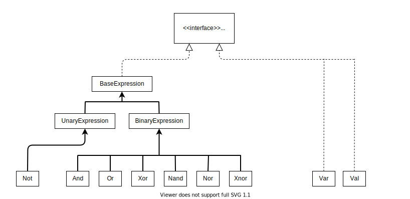

## Introduction

<p align="left">
  
In this project I implemented a system that can represent nested logical expressions that include variables, 
evaluate their values for specific variable assignments, convert them, and simplify the results.

It can be used to:
* Evaluate and simplify logical expressions.
* Performs procedures on the expression such as nandify and norify.
  
## UML Diagram of the project

<p align="center">



</p>

## Example:


**Will print:**


## Explanation:
String display of the expression, and it's evaluation:


Nandify:


Norify:


Simplification:


## Installation
1. Clone the repository:
    ```
    git clone https://github.com/LiavBurger/Logical-Expressions-Interpreter.git
    ```

2. Open the project from an IDE of your choice.
3. Make sure an updated JDK is set in the configuration, and the src folder of Logical-Expressions-Interpreter is set as the source root.
4. Create a configuration with ExpressionsTest as the Main Class, run it, and enjoy!

    
